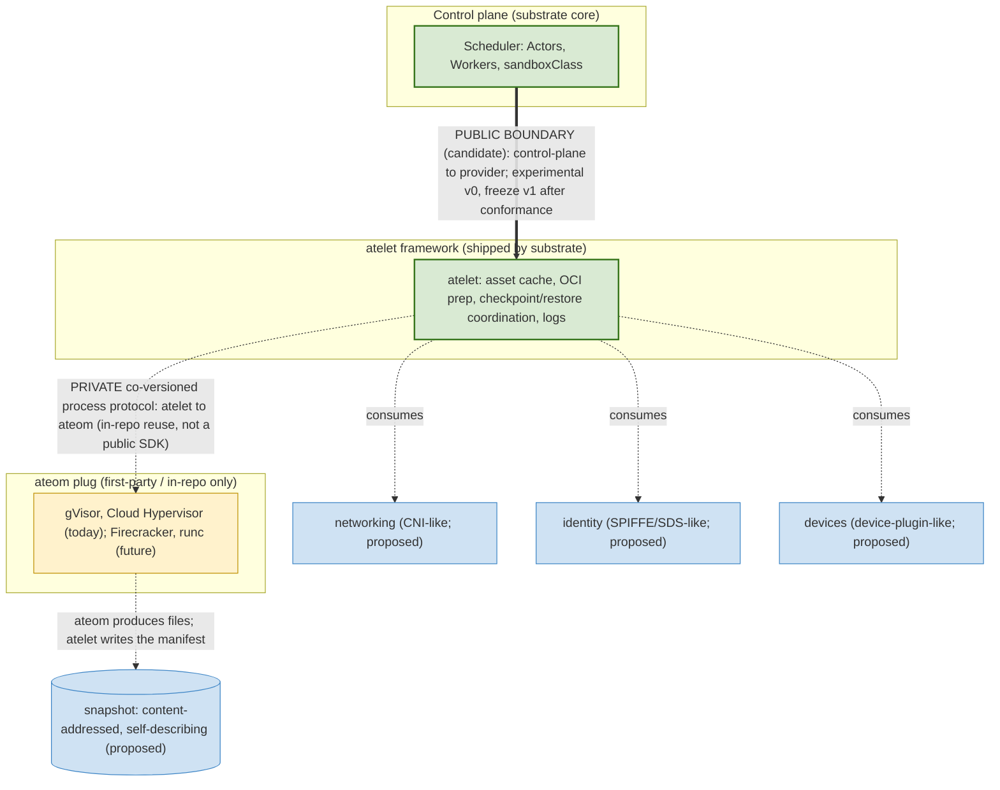
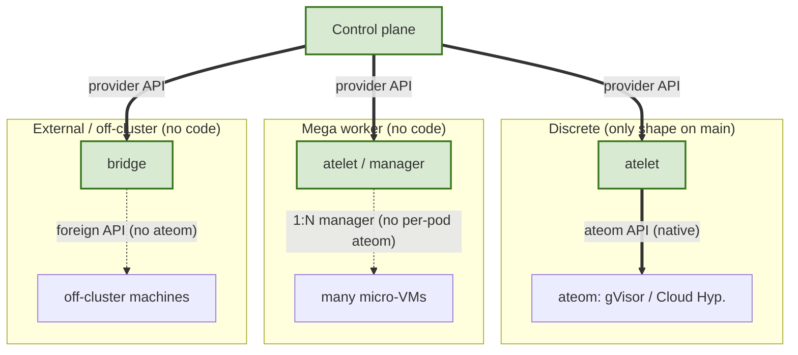
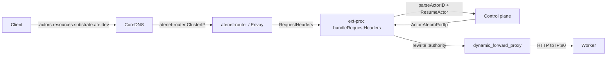
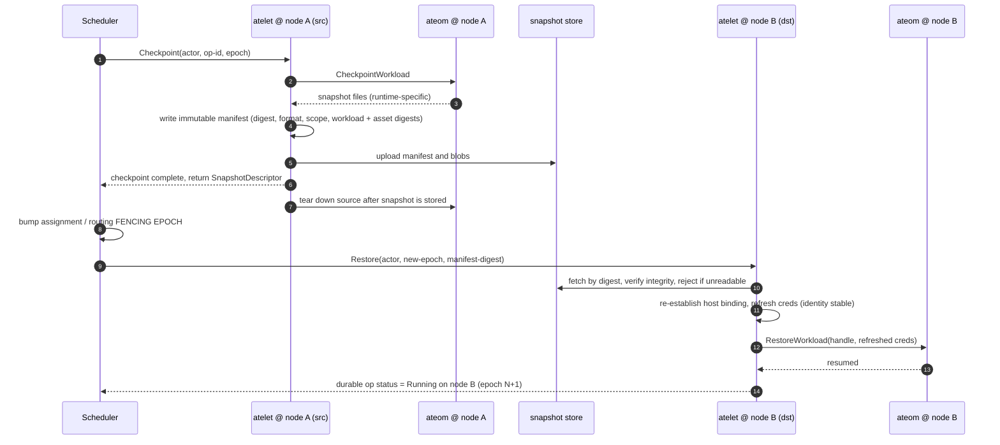

# Dataplane Pluggability

**Status:** Proposed, for review. This is an RFC, a position proposal. It is not
an approvable architecture decision record, and it is not a contract. Several
questions below, including who owns capacity, the lifecycle shape, and how
providers are discovered, can still change what the chosen boundary means in
practice. The contract sketches in it are illustrative, and a number of
questions are still open (see [Open questions](#open-questions)). The target
design is not built yet. What exists on `main` today is described in
[The dataplane today](#the-dataplane-today) and [Current
status](#current-status). The project makes no backward compatibility
guarantees at this stage.

For background see the [architecture](../architecture.md) and
[glossary](../glossary.md); for the user facing CRDs see the [API
guide](../api-guide.md); for where code lives, and the rule about `pkg/` versus
`internal/`, see [code layout](code-layout.md).

A few terms are used throughout. The *atelet* is the per node agent that the
control plane drives to run actors. The *ateom* is the process inside a worker
pod that drives the sandbox runtime on the atelet's behalf. The *ateapi* is the
client facing control plane API.

<!-- toc -->
- [Summary](#summary)
- [Motivation](#motivation)
  - [Goals](#goals)
  - [Non-Goals](#non-goals)
- [The dataplane today](#the-dataplane-today)
- [Proposal](#proposal)
  - [Where the public boundary sits](#where-the-public-boundary-sits)
  - [Why the boundary is high](#why-the-boundary-is-high)
  - [The cross-cutting concerns become their own contracts](#the-cross-cutting-concerns-become-their-own-contracts)
  - [The snapshot is a data contract](#the-snapshot-is-a-data-contract)
  - [The request data path](#the-request-data-path)
  - [Two ways to integrate](#two-ways-to-integrate)
- [Design details](#design-details)
  - [The provider contract](#the-provider-contract)
  - [Capacity and the Worker record](#capacity-and-the-worker-record)
  - [Discovery and transport](#discovery-and-transport)
  - [The workload contract a provider must honor](#the-workload-contract-a-provider-must-honor)
  - [Config, secrets, and identity](#config-secrets-and-identity)
  - [Observability](#observability)
  - [Run and relocation flows](#run-and-relocation-flows)
  - [Failure and recovery](#failure-and-recovery)
- [Trust and tenancy](#trust-and-tenancy)
- [Alternatives considered](#alternatives-considered)
- [Drawbacks](#drawbacks)
- [Open questions](#open-questions)
- [Current status](#current-status)
<!-- /toc -->

## Summary

Agent Substrate runs an actor's workload inside a sandbox on a worker pod. A
node agent called the atelet drives that sandbox, and the control plane drives
the atelet. We want more than one kind of sandbox runtime, and eventually more
than one kind of dataplane, without rewriting the control plane each time.

This document proposes where the public plugin boundary for the dataplane
should sit. We propose to make the control plane to provider boundary, which is
today the scheduler to atelet link, the one public contract that outside
implementers target. The atelet to ateom link below that boundary is a private
detail that substrate's own runtimes share, rather than a published interface.
The provider API is the one primary public control protocol that an implementer
targets, but it is not the only public surface. The CRDs, the Worker record, the
snapshot artifact, and the cross cutting contracts described later are also
things that something outside depends on. The proposal also names a third seam
that the current
design leaves implicit, the request data path that delivers client traffic to a
running actor. None of this is built yet, and nothing here is frozen.

## Motivation

Today the only part of the dataplane you can swap is the ateom image. A
`WorkerPool` chooses it with `spec.ateomImage`, and that is how gVisor and the
micro VM runtime differ. The atelet, which is the layer we would actually want
to be pluggable, is a single binary. The control plane finds it by a fixed
Kubernetes label and requires exactly one atelet per node, and it talks to it
over a plaintext gRPC connection. There is no way to register a second
implementation, to select among implementations, or to negotiate a contract
version.

We want two things that this cannot support. First, we want to add new sandbox
runtimes without special casing them across the system. Second, we want a third
party to be able to provide a whole dataplane, including capacity that does not
live on this Kubernetes cluster at all. Both require a stable contract to build
against, and a clear statement of which seam that contract is.

### Goals

- State which seam is the public, stable plugin boundary, and why.
- Keep the control plane and scheduler unaware of any runtime's internals.
- Describe the three seams a provider must satisfy: how its capacity appears,
  how it runs an actor's lifecycle, and how client traffic reaches the actor.
- Be honest about the gap between this target and what exists on `main` today,
  so reviewers can see what is decided, what is built, and what is open.

### Non-Goals

- This is not an implementer specification. The contract field names and shapes
  here are sketches to make the discussion concrete.
- We do not freeze any contract in this document. Freezing happens later, after
  a conformance suite passes (see [Open questions](#open-questions)).
- We do not design the carve out contracts for networking, identity, and
  devices here. We only argue that they should be separate contracts.
- We do not solve out of tree distribution of the ateom runtime. The ateom
  stays in the repository.

## The dataplane today

The dataplane has three components. The atelet is a node agent, run as a
DaemonSet. The ateom is the process inside each worker pod that drives the
sandbox runtime. Worker pods are the capacity that actors run on. An actor is
the unit that the system runs, suspends, and resumes.

A pluggable dataplane has three seams, not one.

1. Describing capacity. This is how worker pods come to exist and stay alive.
   It is a reconcile loop that pushes desired capacity and reacts to liveness,
   not a request and response call.
2. The runtime contract. This is how the control plane runs an actor's
   lifecycle, meaning run, checkpoint, and restore, on a worker.
3. The request data path. This is how live client traffic finds and reaches a
   running actor. It is easy to overlook because it is separate from the other
   two, and it is not built for any provider other than the pod backed one.

The most important fact about the current code is that the seam this document
proposes to make public is today the least pluggable layer in the system. There
is exactly one atelet binary. The control plane finds it for a given worker by
the worker's node, using a fixed label (`app in (atelet)`) in the `ate-system`
namespace, and it fails if it does not find exactly one atelet on that node
(`dialer.go` returns `found %d atelet pods on node %q, expected 1`). It then
dials that pod over plaintext gRPC (`insecure.NewCredentials()`). There is no
registration, no way to select an implementation, and no contract version.

What is swappable is the ateom. Two runtimes exist today, `cmd/ateom-gvisor` and
`cmd/ateom-microvm`. The Firecracker and runc runtimes shown in some diagrams do
not exist yet. The control plane already never reaches the ateom directly:
`cmd/ateapi` imports the atelet protocol and never the ateom protocol. That is
the property we want to keep, although today it holds only because there is one
implementation to reach.

## Proposal

### Where the public boundary sits

We propose that the public interop boundary is the control plane to provider
seam, which is the atelet API today, and not the atelet to ateom seam. Beneath
that boundary sits a reusable atelet framework and a private ateom plug that
substrate's own runtimes implement. The framework does the heavy node plumbing
once, and each runtime implements only the sandbox mechanics.



The green nodes in the diagram mark the intended public boundary. They are not a
built or frozen contract today.

Three rules follow from this choice. The provider API is the one contract we
commit to keeping stable for outside implementers, so a third party adds a
dataplane by implementing it. The atelet to ateom plug is private. It is shared
in the repository by first party runtimes, it is versioned together with the
framework, and it may change between releases. Because the atelet runs as a
DaemonSet and the ateom image is chosen independently per WorkerPool, the two can
roll at different times, so being versioned together does not by itself prevent a
new control plane from talking to an old plug or the reverse. The plug therefore
needs version negotiation, an explicit compatibility window, or an enforced
upgrade and drain order, so that an atelet rollout does not strand existing
WorkerPools. Stability is earned rather than declared. The provider seam stays experimental until a first version is
validated and a conformance suite across more than one provider passes, and only
then is it frozen.

This is not the only compatibility surface. The client facing API, the CRDs,
the `Worker` record that providers and the scheduler share, and the snapshot
artifact are all things that something outside depends on. The provider API is
the primary one for an implementer, but it is not the only one. None of these
has a compatibility guarantee today.

### Why the boundary is high

The provider seam is the only one that every deployment shape has in common. The
ateom seam is natural for only one of them.



A discrete sandbox has one ateom per worker pod, which is the natural place for
the ateom seam. A mega worker is a single pod that manages many micro VMs
through a private interface. It can still present a per actor service, so an
ateom there is awkward rather than impossible. External capacity does not run on
this cluster at all. It has no pod and no ateom. So the intent that every shape
shares, which is run, checkpoint, and restore this actor and here is my
capacity, is the thing a public contract should carry. The ateom is not.

There is also a question of which mistake is recoverable. If we make the public
boundary high and the common case later wants the simpler runtime style
interface, we can add that interface in the framework without breaking anyone.
If we make the public boundary low and a future shape has no ateom, we have to
break the contract. We would rather keep the recoverable option.

### The cross-cutting concerns become their own contracts

The reason the boundary cannot simply sit at the atelet to ateom seam is that a
group of concerns are specific to both the runtime and the environment, so they
leak across whatever single seam you pick. Four of them decide the boundary.

- The snapshot format and the work of rebinding an actor to a new host on
  restore. This is the feature with no equivalent in the container runtime
  interface, and the hardest to keep out of a shared contract.
- Network delivery. The desired attachment, meaning attach to this network with
  this policy, is the same for every runtime. The delivery is not. gVisor uses a
  host prepared network namespace. A micro VM needs a host tap plus an agent
  inside the guest to program the interface over vsock. An external provider
  translates the request into a foreign API.
- Identity delivery and attestation. The control plane mints the credential. How
  the workload receives it, and how the sandbox proves it deserves it, differ by
  runtime.
- Capacity overhead and capability discovery. This is runtime specific data that
  has to reach the scheduler no matter where the lower seam sits.

Kubernetes faced the same pattern and solved it by pulling networking, storage,
and devices out of the container runtime interface into their own contracts,
which kept that interface narrow. We propose to do the same. Each hard concern
gets its own contract and a shared default implementation, rather than being
pushed through the runtime seam. Today these concerns are owned by each runtime.
The carve out contracts are the proposed direction, not current behavior.

### The snapshot is a data contract

Snapshot and restore is the feature with no clean analog in existing runtime
interfaces, so the durable promise across implementations is a data format
rather than a live API, in the same spirit as a container image. We propose that
a snapshot is an immutable, content addressed, self describing artifact. The
control plane moves a small descriptor and never reads the bytes.

- A descriptor of the form `{media_type, digest, size}` refers to a manifest.
  The digest is not stored inside the manifest it names, since that would be
  circular. The manifest records the blobs, the platform, the scope, encryption
  metadata, the actor and tenant it belongs to, and a namespaced format
  identifier, and it ties back to the immutable workload. Because this is a
  content addressed artifact, it needs a canonical serialization and an algorithm
  qualified digest, so the same manifest always produces the same digest. Whether
  the format identifier and version travel on the wire or live only in the
  manifest is open. A restore must reject an artifact it cannot read rather than
  corrupt it.
- A digest proves integrity, not authorization. A provider may read or restore a
  snapshot only through an authenticated capability from the store or a broker,
  never because it happens to hold the digest. See [Trust and
  tenancy](#trust-and-tenancy).
- The manifest binds the artifact to a specific actor and tenant by reference,
  through an `ActorRef` and a `TenantRef`, and it records state that can move with
  the actor, such as its interior address and its durable data. Live credentials,
  tokens, and SVIDs are never stored in the snapshot. Bindings that are local to a
  host, such as the pod IP, the network device, the credentials, and the clock,
  are delivered fresh and re-established on the new host at restore time.
- Because an untrusted provider may author the manifest, a matching digest proves
  integrity only. It does not prove that the contents, or the actor and tenant
  binding the manifest claims, are truthful. The authoritative envelope therefore
  has to be authored or signed by a trusted component, and who signs it is open.
  See [Trust and tenancy](#trust-and-tenancy).
- If the control plane never reads the manifest body, it cannot use a format
  identifier that exists only inside the manifest to make placement decisions. So
  either compatibility selection is entirely the provider's responsibility, or
  opaque compatibility metadata has to travel in the descriptor or on the `Worker`
  record, not only in the manifest.
- A process snapshot is the near term mechanism for pausing an actor. A demand
  paged alternative is left open, so we do not freeze the snapshot file set as a
  public format on the assumption that snapshots are the only way to pause.

### The request data path

The first two seams decide where an actor runs. This third seam is how client
traffic reaches it once it is running. A provider that gets placement right but
ignores this seam produces actors that are scheduled but cannot be reached.



The diagram shows the current routing only. It omits the authentication, the
authorization, the upstream TLS, the routing epoch, and the tenant binding that a
public route target would require.

Today the path works as follows. Every actor has a stable DNS name of the form
`<actor-id>.actors.resources.substrate.ate.dev`. The suffix is the constant
`ActorDNSSuffix` in `internal/resources/actor.go`. The name resolves to the
`atenet-router` service address. The DNS controller in `cmd/atenet/internal/dns`
reads that service and programs CoreDNS. Every actor name resolves to the one
router address, so the actor identity survives only in the request's Host
header. The router runs Envoy, programmed over xDS by
`cmd/atenet/internal/router/xds.go`, with an external processing filter ahead of
a dynamic forward proxy. For each request the external processing server,
`ExtProcServer.handleRequestHeaders` in `extproc.go`, reads the actor ID from the
Host header, calls `ResumeActor`, reads the resulting `Actor.AteomPodIp`, and
rewrites the request so the proxy connects to that address.

A worker can receive traffic today only if it meets three conditions that the
router code enforces but no published interface states. The worker serves HTTP,
and the upstream connection is hardcoded to port 80 (`extproc.go` builds
`net.JoinHostPort(workerIP, "80")` and carries a `TODO(bowei)` to support other
ports). There is one routable target per worker. The worker is reachable at the
address in `Worker.Ip`, which the control plane sets to the pod's IP in
`controlapi/syncer.go`. The inbound listener ports are configuration and default
to 8080, which is a separate matter from the upstream port.

When an actor moves to a new worker, the control plane writes the new address
onto the actor record during resume. The router does not cache routes and is not
told to invalidate anything. It reads the new address on the next request,
because every request resolves the actor again through `ResumeActor`. This means
there is no routing epoch and no way for the router to reject a request aimed at
a stale worker. The fencing property discussed in [Run and relocation
flows](#run-and-relocation-flows) is therefore not buildable with the current
data path. Making it real requires the router to carry and check a routing
epoch, which does not exist today.

For a custom provider this seam is open work. The actor must be reachable over
HTTP, and the address must reach the router through the `Worker` record. The off
cluster shape does not fit today, because `Worker.Ip` comes from a pod IP and the
proxy dials it on port 80. Generalizing the route target to a host and port, or a
URL, and lifting the hardcoded port are both unbuilt. Letting an untrusted provider
set an arbitrary host, port, or URL as the route target would let it aim the router
at cloud metadata services, control plane endpoints, other tenants, or arbitrary
internal addresses. Route targets must therefore be authenticated, authorized,
restricted to allowed networks, and cryptographically bound to the specific actor,
tenant, provider, worker, and epoch.

### Two ways to integrate

There are two ways to add a runtime or a dataplane, and only the second is open
to a third party.

The first is a first party in tree runtime, such as a new gVisor style runtime,
a different micro VM monitor, or a runc backend. The author implements only the
ateom plug and inherits all of the node plumbing from the framework. This is the
low effort path, but it is for substrate's own runtimes, because the plug is
internal to the repository.

The second is for anyone else, and for the shapes that have no ateom, meaning the
mega worker and external shapes. The author implements the provider API directly.
A provider on this path does not inherit the framework's networking, identity,
asset fetching, or snapshot handling, so either those become public contracts it
can call, or the provider supplies them itself.

## Design details

The names and field shapes in this section are sketches. They are meant to make
the proposal concrete, not to be the final contract. Several of them depend on
the [Open questions](#open-questions) being resolved.

### The provider contract

The contract on `main` today is the `AteomHerder` service in
`internal/proto/ateletpb`, with three calls, `Run`, `Checkpoint`, and `Restore`.
It carries the full `WorkloadSpec` inline, which is workload intent, meaning
images, command, environment, volumes, and readiness. Runtime mechanism leaks in
through other fields, such as `target_ateom_uid`, the sandbox assets, and the
mutable snapshot locations.

A target contract would express intent and capacity, carry an opaque snapshot
descriptor, and report durable status. The sketch below shows the shape we have
in mind. It does not settle the questions about capacity authority, lifecycle
shape, durable status, or fencing. The sketch deliberately leaves out a `Register`
call, because asking a provider to register from a service that the control plane
calls is backwards, and registration belongs to the `ProviderRegistration` instead.
The `actor_generation` and `assignment_epoch` fields also need to be told apart.

```proto
service Provider {                                   // control plane -> dataplane provider
  rpc AssignActor(AssignActorRequest) returns (OpAck);          // level-triggered; durable op handle
  rpc Checkpoint (CheckpointRequest)  returns (OpAck);          // produces a SnapshotDescriptor
  rpc Restore    (RestoreRequest)     returns (OpAck);          // consumes a descriptor; binds a new epoch
  rpc OpStatus   (OpRef)              returns (stream OpStatus); // durable; survives reconnect
}
message AssignActorRequest {
  ActorRef actor = 1; uint64 actor_generation = 2;   // immutable per (re)assignment
  uint64 assignment_epoch = 3;                        // fencing: stale-epoch ops are rejected
  string op_id = 4;                                   // idempotency key
  string sandbox_class = 5; DesiredPhase desired = 6; // RUNNING | CHECKPOINTED | GONE
  WorkloadDescriptor workload = 7;                    // immutable, content-addressed
}
message SnapshotDescriptor { string digest=1; string media_type=2; uint64 size=3; } // digest is algorithm-qualified, e.g. sha256:...
message SnapshotManifest {  // referred to by the descriptor, so its digest is not circular
  string format_id=1; uint32 format_version=2; SnapshotScope scope=3; bytes workload_digest=4;
  repeated BlobDescriptor blobs=5; Platform platform=6; EncryptionInfo encryption=7; TenantRef tenant=8;
  ActorRef actor=9;                                   // binds the artifact to a specific actor by reference
  repeated AssetDep asset_deps=10; }                  // exact runtime-asset digests, pinned
```

The service above is control plane to provider only. Registration and capacity
leasing are a separate provider to control plane concern, handled by the
`ProviderRegistration` described under [Capacity and the Worker
record](#capacity-and-the-worker-record), which is why there is no `Register` call
in this service. The level triggered `AssignActor` mixed with the imperative
`Checkpoint` and `Restore` is still unresolved, and we keep that warning here.

For contrast, the private runtime plug is versioned together with the framework
and never published. It is the `Ateom` interface with `RunWorkload`,
`CheckpointWorkload`, and `RestoreWorkload`, which take inputs that the framework
has already prepared, such as the OCI bundle, a network handle, brokered
credentials, and device and asset handles. A restore receives a fresh network
and identity rather than reading them from the snapshot. A `Capabilities` call
reports whether the runtime supports checkpoint, migration, and devices, along
with its overhead and the snapshot formats it can restore, and that report is the
mechanism behind the capability discovery concern named earlier.

### Capacity and the Worker record

How worker pods come to exist is a reconcile loop, which is a different shape from
the runtime call. One model is a capacity provider that reconciles `Worker`
records and reports liveness, so that a Kubernetes pool, an external machine
bridge, and a cloud autoscaler are three implementations of one seam. None of
this is built. Today capacity is the controller that turns a `WorkerPool` into
pods, plus a worker cache that relists periodically.

It is worth being precise about what capacity is today, because it shapes what is
possible. Capacity is a count of free `Worker` records, and one record is one
schedulable actor slot. A `WorkerPool` declares a number of replicas, the
controller renders that into a Deployment (`workerpool_apply.go`), and the control
plane turns each worker pod into exactly one `Worker` record
(`WorkerPoolSyncer.syncWorkerToStore` in `controlapi/syncer.go`). Placement does
no resource arithmetic. `eligibleWorkerPools` filters pools by sandbox class and
label selectors, and `AssignWorkerStep.findFreeWorker` (both in
`workflow_resume.go`) picks a free worker at random from the eligible set. There
is no bin packing and no overhead accounting. Per worker sizing is left entirely
to the Kubernetes pod requests on the pool template, so an operator has to fold
any sandbox overhead into those requests, because substrate never sees a number
it could subtract.

The one to one mapping is fixed, and it matters. The `Worker` message in
`pkg/proto/ateapipb` carries a single `actor_id`, not a list. Assignment sets it
and release clears it, so one worker holds at most one actor. There is no concept
of allocatable slots. As a result the mega worker shape, where one pod hosts many
actors, cannot be expressed on `main` at all.

To bind actors to workers without assuming a Kubernetes pool, the `Worker` record
needs to carry more than it does. Today it carries no sandbox class, and the
scheduler reads the class off the `WorkerPool`. Its existing `version` field is an
optimistic concurrency token, not a contract version. The `Worker` still needs a
sandbox class on the record. We do not, however, propose to stamp a contract
version onto every `Worker`. Protocol compatibility should be negotiated once
between the control plane and a provider when the provider registers, not
duplicated on every worker. We propose a `ProviderRegistration` record that
carries the provider's identity, endpoint, incarnation, contract version, and
advertised capabilities. A `Worker` references its `ProviderRegistration` rather
than repeating those fields. Actors are scheduled by the workload's runtime needs,
meaning the sandbox class and the capabilities it requires, not by which revision
of the provider RPC the control plane happens to speak. To select among providers
the `Worker` record will still need placement labels, health, and a backpressure
signal, alongside the reference to its `ProviderRegistration`. What capacity
itself should be is open. It could stay a slot count, it
could become a set of resources that the scheduler bin packs, or it could be an
opaque value matched only by label. That choice is upstream of who owns the
`Worker` record's lifecycle, because you cannot say who creates and deletes a
`Worker` until you know whether a `Worker` is a slot, a machine, or a budget.

### Discovery and transport

Today discovery is by topology. The control plane takes the assigned worker's
node, finds the single atelet on that node by label, and fails if there is not
exactly one. It dials that atelet on port 8085 over plaintext gRPC. This is why
the atelet is not pluggable. The address is tied to a node, there can be only one
per node, and there is no provider identity to select on.

In the target the provider's endpoint, identity, incarnation, and contract version
live on its `ProviderRegistration`, and a `Worker` references that registration
and carries its own health. The control plane connects to the registered endpoint
per worker. The endpoint need not be a pod, so it can be an off cluster bridge. The
transport gains mutual TLS, authorization, and epoch fencing, described under
[Trust and tenancy](#trust-and-tenancy). Who writes and owns the
`ProviderRegistration` and the `Worker` record is the open question above.

### The workload contract a provider must honor

Once a provider is reached, the lifecycle calls are a behavioral contract, not a
data bag. Returning success has a meaning that other parts of the system rely on.
The list below is what we have observed the two in tree runtimes do, and it is
what a new provider has to honor. The target adds operation ids, fencing, and
durable status on top, but the behavior below is already in place on `main`.

Not every provider can implement every behavior below, and an external or
serverless provider may support only a subset. The contract should therefore
define a small mandatory floor, for example run and a basic readiness signal, and
treat the rest as capabilities a provider advertises and the scheduler matches
against, rather than as universal requirements. The capabilities in that second
group include multi-container sandboxes, golden restore, the Full and Data scopes,
DurableDir volumes, and checkpoint teardown.

- A provider must not report that `RunWorkload` or `RestoreWorkload` succeeded
  until every container that declares a readiness probe returns HTTP 200. The
  gate runs inside the runtime, not in the kubelet. Both runtimes call
  `readyz.WaitAll` (in `internal/readyz`) as the last step before returning, with
  a 30 second timeout, and a timeout has to surface as an error. This is required
  rather than optional. The 30 seconds is the current in tree value and not a good
  fixed rule for a public contract, so the readiness deadline should be part of the
  workload's policy or the operation's deadline rather than a frozen constant. The
  golden snapshot warm up relies on it: the controller
  skips its settle delay only when every container declares a readiness probe,
  because in that case the resume already blocked until the workload reported
  ready. A provider that reports success too early will capture a half
  initialized process into the golden snapshot that every later actor restores
  from.
- The first time an actor runs it is usually a restore from the shared golden
  snapshot, not a cold start. The resume path checks for a per actor snapshot,
  then the template's golden snapshot, and only then cold boots. The golden case
  is an external restore at the OnCommit scope. So `RestoreWorkload` has to work
  for an actor that has never run on this provider, and the same golden snapshot
  is restored by many actors at once. A golden snapshot produced by one provider
  may not be restorable by another provider even when both advertise the same
  sandbox class, so the scheduler needs provider and format compatibility rules
  before more than one provider can serve the same class.
- The checkpoint call carries two independent settings. The type decides where
  the snapshot lives. A pause uses the local type, which keeps the files on the
  node. A suspend uses the external type, which uploads them. The scope decides
  what goes into the snapshot. Full captures process memory plus the rootfs
  delta, including any durable directory volumes. Data captures only the durable
  directory volumes. The scope is set per trigger on the template, with OnCommit
  required to be a subset of OnPause. A provider must reject a scope it cannot
  satisfy rather than quietly capture less. gVisor, for example, returns an error
  on the data scope when there are no durable directory volumes, and on any scope
  it does not recognize.
- The unit a provider hosts is a sandbox of one or more containers, not a single
  process. On gVisor the sandbox root is a dedicated pause container that is
  created first and checkpointed as the root. On the micro VM the VM itself is the
  sandbox, created once over the guest agent before the containers start. A
  provider must treat sandbox setup and teardown as a step distinct from the
  containers.
- Durable directory volumes survive a suspend and resume independently of process
  memory, and they are the only thing a data scope snapshot captures. A provider
  that cannot snapshot them cannot offer the data scope.
- Per actor identity is delivered as a file at `/run/ate/actor-id`, bind mounted
  fresh on each resume rather than passed as an environment variable, because an
  environment variable would be frozen into the golden snapshot at the golden
  actor's value. This is present on gVisor application containers but not the
  pause container. It is absent on the micro VM today, whose root filesystem is a
  virtio-fs base with a guest memory upper layer, so there is no host path to bind
  to. Exposing identity inside the guest needs a per actor volume and is not yet
  implemented, which is a documented gap in `cmd/ateom-microvm/spec.go`. On a
  runtime where the guest cannot see host paths, a provider has to deliver identity
  through its own channel. The manifest may bind the artifact to a specific actor
  and tenant by reference, but live credentials, tokens, and SVIDs are never stored
  in the snapshot and are delivered fresh on restore.
- There is no separate delete call. The runtime interface has only run, checkpoint,
  and restore. Checkpoint tears the source actor down as part of its contract. On
  gVisor it deletes the containers and the pause container and cleans up the
  network. On the micro VM it shuts down the VM. So there is no warm copy left
  behind, and a cross node move is a cold relocation rather than a live migration.
  Deleting an actor at the control plane is a separate operation that only removes
  a suspended actor's record and never reaches the runtime.

A custom provider that does not inherit the in tree framework has to supply the
mechanism around these calls itself, meaning networking, identity delivery, asset
fetching, and snapshot movement.

### Config, secrets, and identity

Configuration and secrets reach a workload through container environment
variables. The only supported source other than a literal value is a Kubernetes
secret reference, and the control plane resolves it from the actor template's
namespace into a plaintext value (`workload_spec.go`). Resolving it requires a
cluster client, and the call fails with a precondition error when there is no
client. The plaintext value is injected into the process, and the process memory
is what gets checkpointed, so the value is captured into the golden snapshot and
frozen there. There is no rotation. A 30 second cache only deduplicates reads
within a single resume. The brokered, epoch bound secret delivery described under
trust and tenancy is the target. Today it is a resolved plaintext secret in an
environment variable, baked into the snapshot. A broker bound to the assignment
epoch prevents reuse of a stale credential, but it does not keep the credential
confidential from the provider, because a provider that controls execution can read
the workload's memory after delivery. A tenant must trust its provider with
plaintext workload data unless an attested trusted execution environment provides
end to end protection.

There are two identity surfaces, and both assume Kubernetes. The session identity
broker, with `MintJWT` and `MintCert` in `pkg/proto/ateapipb`, gives a workload a
session identity that stays stable as the session moves across workers. That part
is real and useful. The problem is how the broker authenticates the caller.
`MintJWT` verifies a Kubernetes service account token, and `MintCert` requires a
pod certificate. A workload that is not a Kubernetes pod has neither, so it cannot
obtain a session identity at all. The other surface is the per actor identity file
described above, which has no authentication and does not exist on the micro VM.

An off cluster provider can satisfy neither path as built. It cannot present a
service account token or a pod certificate to the broker, and the control plane
has no secret source other than a Kubernetes secret in the template's namespace.
A separate config, secret, and identity path for off cluster providers is open
work, and it should be designed together with the brokered secret target so the
two converge.

### Observability

Observability is a contract a provider must match, not an open choice, even
though no part of the seam states it today. The first party servers share an
implementation in `internal/serverboot`, and the cluster scrapes and collects on
the assumption that a provider behaves the same way. A provider that does not use
the framework has to reproduce all of it.

- A Prometheus metrics endpoint on port 9090, with the usual scrape annotations.
  Today the atelet serves this, but the ateom binaries do not.
- OTLP traces and metrics, sent in plaintext to the endpoint named by the
  `OTEL_EXPORTER_OTLP_ENDPOINT` environment variable, with
  `OTEL_RESOURCE_ATTRIBUTES` supplying the resource attributes rather than the
  endpoint. The plaintext posture matches the provider link. Today the atelet
  exports both, and the ateom binaries export traces but not metrics.
- A `/readyz` endpoint on the server. Today only the API server exposes one. A
  provider readiness endpoint is part of the target, and it is a different thing
  from the workload readiness gate above.
- Trace context propagation over gRPC, so a single trace runs from the control
  plane through the atelet to the ateom without a break.
- Structured JSON logs for the workload, forwarded with a fixed label schema that
  includes the actor id, the template name and namespace, and the container name,
  plus synthetic lifecycle events. On Google Cloud the label key changes to the
  Cloud Logging key. This lives in `internal/actorlog`.

The specific port 9090, the scrape annotations, the environment variables, and the
plaintext OTLP transport are the in tree Kubernetes deployment mechanism, not the
contract itself. A public contract should instead define the required signals,
meaning metrics, traces, and structured logs, along with trace propagation, and
leave the transport to the deployment.

So the list of what a custom provider supplies itself grows to include log
forwarding, metrics, and traces. There is no workload exec, attach, or port
forward anywhere on `main` today, so whether a provider must offer any of those is
open and starts from nothing.

### Run and relocation flows

On a run, the scheduler states the intent. The framework fetches assets by digest,
prepares the OCI bundle, and, in the proposed carve out model, prepares the network
and devices and brokers credentials for the assignment epoch while the actor
identity stays stable. It then calls the runtime with prepared inputs.

A cross node move is a cold relocation, because checkpoint tears the source down.
The runtime produces a snapshot recorded as a content addressed manifest. The
scheduler advances a fencing epoch and places the actor on a node. That node
fetches the snapshot by digest, verifies it, re-establishes its host binding, and
refreshes credentials for the new epoch, and then restores. A rollback is a
restore of the same snapshot again. The fencing epoch, rather than a report that
the destination is running, is what prevents two workers from serving the same
actor. For that to hold, the epoch has to be enforced at the router, at credential
issuance, at any externally visible write, and at the assignment record, not only
by rejecting a stale call. None of the epoch machinery exists on `main` today, and
because checkpoint destroys the source there is no warm copy.



The split-brain guarantee depends on fencing at the router, at the credential
broker, and at the assignment record through a compare-and-set. These are not all
built.

### Failure and recovery

Liveness today means the Kubernetes pod exists. There is no heartbeat, timeout, or
health field on the `Worker` record. The worker pool syncer watches pod events,
and a worker cache relists to recover events it may have missed. A worker that
hangs while its pod stays running is still considered alive, so death is only ever
detected as a pod going away.

When a worker pod goes away, recovery is a cold restore from the last committed
snapshot. The actor to worker binding lives in the control plane store, on the
`Actor` record. On a pod delete event the syncer resets the actor to suspended and
clears its worker pointers, and a later resume schedules the actor onto a
different worker and restores it from its last external snapshot. Any state
produced since the last commit is lost. This reset is best effort. The caller
proceeds to delete the worker even if the reset failed, which can leave the actor
marked running while pointing at a pod that no longer exists, and recovery then
needs a manual suspend. This is tracked as issue
[#23](https://github.com/agent-substrate/substrate/issues/23), with a proposed fix
that holds the pod in terminating until the actor is suspended gracefully.

A local snapshot does not survive the loss of its node. A pause records the
snapshot as local and pins it to the node it ran on. On the next resume the
scheduler treats that node not as a preference but as a hard restriction, so if
the node is gone the snapshot is gone with it, and there is no external copy to
fall back to. Durable recovery needs an external snapshot from a prior suspend.

A liveness contract for providers that are not Kubernetes pods is open. Such a
provider has no pod to watch. A crashed, partitioned, wedged, or malicious provider
cannot reliably report its own death, so liveness for non-pod providers needs a
control plane observed mechanism such as a lease with an expiry, a heartbeat expiry
checked by the control plane, or active probes, not only a health value the
provider writes. Whatever the mechanism, the existing reset path would fire from
that signal instead of from a pod delete event.

## Trust and tenancy

A public provider is untrusted. It can misreport its capacity, replay operations,
read workload secrets, or try to restore another tenant's snapshot. Trust
assumptions differ by component, so they should be stated separately for the
control plane, the provider, the framework, the private plug, the worker host, and
the workload. A provider that controls execution can see workload data and can
falsify execution unless there is a confidential computing guarantee.

Today the link from the control plane to the atelet is plaintext, and none of the
controls below exist. Before the provider seam is frozen, the contract has to
specify the following.

- Mutual TLS, with authorization of the provider and its workers.
- Assignment fencing, where operations carry an epoch and a stale epoch is
  rejected.
- Snapshot access control through an authenticated capability from the store or a
  broker. A digest is integrity, not authorization. Because an untrusted provider
  may author the manifest, a matching digest does not prove the contents or the
  actor and tenant binding are truthful, so the authoritative envelope has to be
  authored or signed by a trusted component, and who signs it is open.
- Capability attestation, so the control plane does not trust a provider's claims
  about its capacity or supported formats without evidence.
- Route target validation. Letting an untrusted provider set an arbitrary host,
  port, or URL as the route target would let it aim the router at cloud metadata
  services, control plane endpoints, other tenants, or arbitrary internal
  addresses. Route targets must be authenticated, authorized, restricted to allowed
  networks, and cryptographically bound to the specific actor, tenant, provider,
  worker, and epoch.
- A brokered model for delivering secrets, where the framework does not hand raw
  secrets to a plugin and the workload obtains its credentials from a broker bound
  to its assignment epoch. A broker bound to the assignment epoch prevents reuse of
  a stale credential, but it does not keep the credential confidential from the
  provider, because a provider that controls execution can read the workload's
  memory after delivery. A tenant must trust its provider with plaintext workload
  data unless an attested trusted execution environment provides end to end
  protection.

## Alternatives considered

The main alternative is to make the ateom API the public, out of tree plugin
surface, so that anyone implements a small three call runtime server. The case for
it is real. One shared atelet writes the difficult node plumbing once, a new
runtime is a small server, and you get one consistent answer to networking,
identity, and the rest. The container runtime interface in Kubernetes is a low
boundary, and the scheduler there does not understand container internals, so a low
boundary does not in itself leak internals. It worked at large scale. The high
boundary does not give that opacity for free either, because the class, the
overhead, the capabilities, the snapshot compatibility, and the placement labels
still travel up to the scheduler whichever boundary we pick.

We still prefer the high boundary, but as a judgement rather than a clear win. The
provider seam is present in every shape, while the mega worker and external shapes
have no natural ateom. The hard cross cutting concerns are not yet designed, so
freezing the low seam now would bake in guesses about networking and identity. And
we keep most of the benefit of the low boundary anyway, because first party
runtimes still get the small runtime interface through the private plug, without us
freezing it.

The table below summarizes the comparison.

| | Boundary at the provider (chosen) | Boundary at the ateom (rejected) |
|---|---|---|
| Runtime detail the scheduler sees | sandbox class, overhead, capabilities, snapshot compatibility, and placement labels still flow up; it does not see runtime internals | the same information flows up; a low boundary does not by itself force the scheduler to understand runtime internals |
| Shared node services (OCI, assets, snapshots, networking, identity) | written once in the framework for first party runtimes; a third party provider does not inherit them and must call public contracts or supply its own | redone per backend unless a shared library is published |
| Out of tree third party runtimes | through the provider API | through the ateom call, which we do not want to make public |
| Evolving the contract | the private plug can change with the framework; the public provider API needs the same compatibility discipline as any public contract | a public ateom API needs that discipline from day one |
| Adding the other boundary later | a lower runtime interface can be added in the framework later | a higher provider API can be added later too; the cost either way is supporting two surfaces, not necessarily breaking the first |
| Shapes with no ateom (mega, external) | supported, since they implement the provider API | not supported without a separate path |

The shape we propose has precedent. Virtual Kubelet puts the public boundary at
the Kubernetes API and offers a reusable provider library underneath. The
containerd shim has a public shim interface, an internal runtime interface, and
shared libraries. Kubernetes networking, storage, and device plugins are carve
out contracts. The container image specification is a data contract for the
artifact rather than a live API. Nomad task drivers are a versioned out of process
plugin protocol, which is the model for the private plug.

## Drawbacks

A provider that genuinely lives outside the repository has to implement the larger
provider API rather than a small runtime server, and it does not inherit the
framework's networking, identity, asset, and snapshot services. So either those
become public contracts it can call, or it reimplements them. The framework
benefit is a first party benefit.

The framework has to be backend neutral, and today the atelet is not. The runtime
plug still has a top level `runsc_path` field, and the asset cache is hardcoded to
runsc hash validation and paths. The PR that neutralizes this is not merged. The
larger risk is organizational. A high boundary with a weak framework drifts into
many divergent atelets, which is the fragmentation a shared framework is meant to
prevent. This choice is only correct if the framework is funded well enough to
stay good.

Shipping several first party atelet binaries means several independently upgraded
copies of privileged node plumbing, which is a real trust and version cost. It is
also not routable today, because the current routing assumes exactly one atelet
per node, so more than one implementation per node first needs class aware or
implementation aware routing on the `Worker` record.

Finally, a restore wants the network, the identity, and the runtime state brought
back together. Several separate carve out contracts may be harder to sequence than
one deliberately larger restore call. This is unresolved.

## Open questions

These have to be resolved before any seam is frozen.

- Who owns capacity. Registration is a provider to control plane concern, handled
  by the `ProviderRegistration` record, and not a call inside the control plane to
  provider service. We still need to say who creates, renews, and deletes the
  `ProviderRegistration` and the `Worker` records, and how a reconcile loop and a
  provider's own registration fit together.
- What a `Worker` is, and its cardinality. One actor per worker, or multiple
  slots per worker for a mega worker. Slot count, resources, or an opaque value.
  This is upstream of the capacity authority question.
- The lifecycle shape. A level triggered desired state, or imperative checkpoint
  and restore calls, or a defined mix. And `actor_generation` and
  `assignment_epoch` need to be told apart.
- Discovery and transport. The exact `Worker` fields needed to find, select, and
  reach a provider per worker.
- Durable status. The scope of an operation id, how long a terminal result is
  kept, how a client reconnects, how retries and cancellation behave, and what
  happens when the same operation id arrives with a different payload.
- Trust and fencing. The per component trust model, and enforcing the epoch at the
  router, at credential issuance, at external writes, and at the assignment record,
  since the router has no epoch today. Snapshot access needs an authenticated
  capability rather than a digest.
- The off cluster path. A config model, a worker registration path, and an
  identity and secret path that do not assume a Kubernetes pod, along with a
  liveness contract for providers that are not pods.
- The snapshot envelope. The split between descriptor and manifest, the blobs,
  the platform, the encryption metadata, the tenant binding, the namespaced format
  identifier, and whether the format identifier travels on the wire or in the
  manifest. Who authors or signs the authoritative envelope is also open, since an
  untrusted provider may produce the manifest.
- Golden snapshot and provider compatibility. A golden snapshot produced by one
  provider may not be restorable by another provider even when both advertise the
  same sandbox class, so the scheduler needs provider and format compatibility
  rules before more than one provider can serve the same class.
- Tenant isolation for a provider that hosts many actors. Today the sandbox and
  pod boundary is the isolation boundary. A mega worker breaks that, so we need to
  state the boundary between actors and tenants inside one provider, the isolation
  between neighbors that share resources, and the separation of each actor's
  secrets and identity.
- The operational contract. Error categories, deadlines, retries, draining a
  provider, and version skew during a rollout. Workload readiness is not open, it
  is required. Workload exec, attach, and port forward do not exist today and are
  open.
- Namespacing and ownership of sandbox class names, snapshot format identifiers,
  capability labels, and media types.

Before we freeze a first stable version, we also need to do the following. Build a
prototype to choose between one larger restore call and several sequenced carve out
calls. Confirm that networking and identity actually split into a part the
framework prepares and a part the runtime consumes. Decide where the snapshot
format version lives. Meet the trust and tenancy bar above. Fund the framework.
And pass a conformance suite across more than one provider. Testing gVisor and the
micro VM behind the same first party provider checks runtime breadth, not
interoperability between providers, so the suite needs a second, independent
provider. The suite would check concrete behaviors, such as that a repeated
operation id is a no op rather than a second run, that an operation carrying a
stale epoch is refused, that a restore rejects a manifest it cannot read or that
belongs to another tenant, that a fetched blob whose digest does not match is
rejected, that operation status survives a disconnect, that a placed actor is
actually reachable on the data path, and that capacity and liveness are reported
as specified.

## Current status

The table below summarizes what exists on `main` today against the target.

| Aspect | Today (`main`) | Target |
|---|---|---|
| Atelet pluggability | one binary, one per node (`dialer.go`), internal, insecure; no registration, selection, or version | registered, version negotiated providers selected per worker |
| Custom implementations | not supported; only the in tree ateom image can be swapped, and someone could replace the single atelet and vendor the internal schema, but there is no supported registration or compatibility contract | implement the public provider API |
| Provider seam | `AteomHerder` (run, checkpoint, restore) in `internal/proto/ateletpb`; carries the full `WorkloadSpec` | intent shaped contract with operation ids, fencing, durable status, one capacity model, and a digest keyed manifest |
| Runtime plug | `Ateom` in `internal/proto/ateompb`; gVisor and micro VM | same role, kept private and co versioned |
| Control plane to runtime | `cmd/ateapi` imports the atelet protocol, never the ateom protocol | kept as a rule |
| Scheduling | filter by sandbox class and selectors, then a random free worker; no resource math | match by the workload's sandbox class and required capabilities; protocol compatibility negotiated once at provider registration |
| `Worker` record | a projection of a pod; no class, version, or health; one actor per worker | adds a sandbox class, a reference to a `ProviderRegistration`, health, and discovery fields; cardinality open |
| Sandbox class | a closed list of `gvisor` and `microvm` on three CRDs | a validated free string (PR [#332](https://github.com/agent-substrate/substrate/pull/332)) |
| Networking, identity, devices | owned by each runtime; `/dev/kvm` is hardcoded per class in the controller | separate carve out contracts; pod shape declared as data |
| Snapshot | a mutable location and a manifest with no format id, version, or digest | a content addressed, versioned manifest with a descriptor |
| Data path | DNS to the router to the external processor to the pod IP on port 80 | a general route target and a routing epoch |
| Liveness and recovery | the Kubernetes pod informer only; cold restore from the last commit; stranding bug [#23](https://github.com/agent-substrate/substrate/issues/23) | control plane observed liveness for shapes that are not pods, through a lease expiry, a heartbeat expiry checked by the control plane, or active probes, not a self reported health value |
| Identity and secrets | Kubernetes bound; the broker needs a service account token or pod certificate; secrets are plaintext env baked into the snapshot | non Kubernetes authentication and brokered, epoch bound secret delivery |
| Provider link security | plaintext gRPC, no controls | mutual TLS and the trust bar above |
| Off cluster and mega shapes | no code; every path is pod bound | the motivating shapes once the above lands |
| Backend neutral framework | partial; `runsc_path` is a top level plug field and the asset cache is hardcoded to runsc (PR [#336](https://github.com/agent-substrate/substrate/pull/336) unmerged) | a neutral framework |

Several pull requests move parts of this toward the target but are not merged. PR
[#332](https://github.com/agent-substrate/substrate/pull/332) opens the sandbox class. PR [#333](https://github.com/agent-substrate/substrate/pull/333) makes the worker pod shape declarative. PR
[#334](https://github.com/agent-substrate/substrate/pull/334) removes some gVisor specific naming from the atelet. PR [#336](https://github.com/agent-substrate/substrate/pull/336) neutralizes the
asset cache names and keeps the runtime contract in `internal/`.
